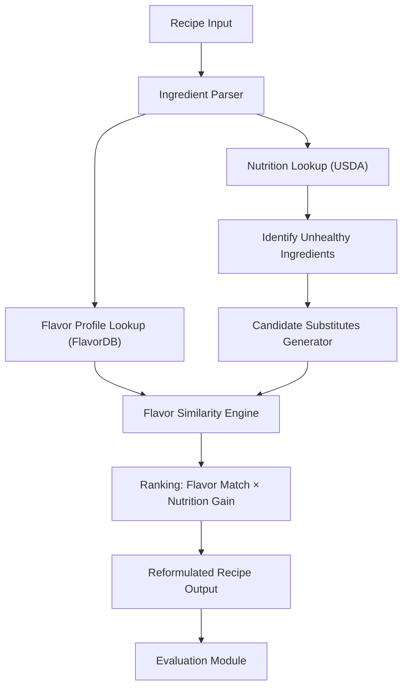
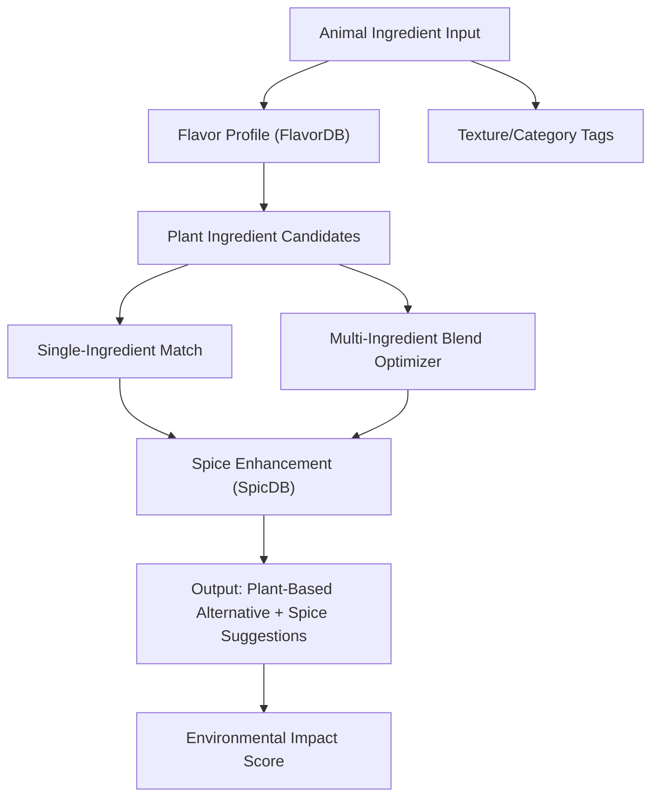
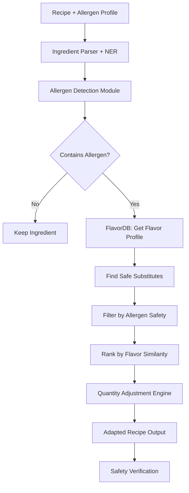
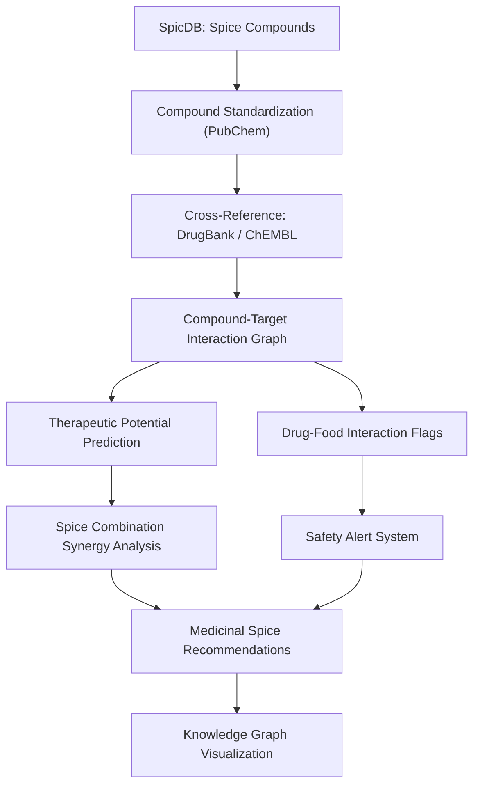
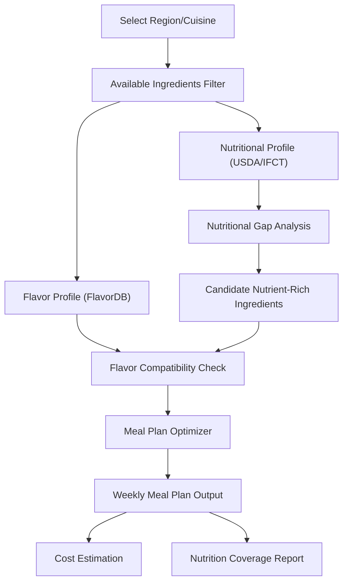
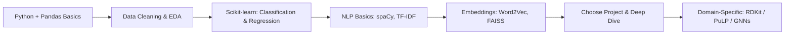

# Computational Gastronomy — Capstone Project Plans

> 5 project ideas with complete technology stacks, architectures, implementation roadmaps, and validation strategies.

---

## 📊 Common Foundation (Shared Across All Projects)

Before diving into individual projects, all of them share a common data and tooling foundation.

### Core Datasets
| Dataset | What It Provides | Format |
|---------|-----------------|--------|
| **FlavorDB** | Ingredients → flavor molecules, taste profiles, odor profiles | Structured DB / CSV |
| **SpicDB** | Spices → bioactive compounds, health properties, phytochemicals | Structured DB / CSV |
| **Recipe Corpus** (Professor's data) | Recipes → ingredients, quantities, cuisine labels, steps | JSON / CSV |
| **USDA FoodData Central** (supplement) | Nutritional info per ingredient (calories, macros, micros) | API / CSV |
| **FooDB** (optional supplement) | Food compounds, health effects | Structured DB |

### Common Tech Stack
| Layer | Technology | Why |
|-------|-----------|-----|
| **Language** | Python 3.10+ | Ecosystem for data science & ML |
| **Data Processing** | Pandas, NumPy | Tabular data manipulation |
| **Visualization** | Matplotlib, Seaborn, Plotly, NetworkX | Charts, graphs, network viz |
| **ML Framework** | Scikit-learn (classical), PyTorch (deep learning) | Model training |
| **Graph Analysis** | NetworkX, PyTorch Geometric (if using GNNs) | Flavor/ingredient networks |
| **NLP** | HuggingFace Transformers, spaCy | Text processing, embeddings |
| **Database** | SQLite or PostgreSQL | Storing merged datasets |
| **Web App (Demo)** | Streamlit or Gradio | Rapid prototyping of interactive demos |
| **Notebooks** | Jupyter Lab | Exploration & experimentation |
| **Version Control** | Git + GitHub | Code management |
| **Environment** | Conda / venv + requirements.txt | Reproducibility |

---

## 🥇 Project 1: Healthy Recipe Reformulation via Flavor-Aware Substitution

### Goal
Replace unhealthy ingredients with healthier alternatives while preserving the recipe's flavor profile using flavor chemistry data.

### Architecture

### Technology Stack

| Component | Technology | Details |
|-----------|-----------|---------|
| **Ingredient NER** | spaCy + custom NER | Extract ingredients from recipe text |
| **Flavor Embedding** | Word2Vec / Autoencoders | Embed ingredients into flavor-compound vector space |
| **Similarity Search** | FAISS (Facebook AI Similarity Search) | Fast nearest-neighbor search in flavor space |
| **Nutrition Scoring** | Custom scoring function | WHO dietary guidelines as constraints |
| **Optimization** | Scipy.optimize / PuLP (linear programming) | Multi-objective: maximize health, minimize flavor drift |
| **Demo App** | Streamlit | Input recipe → get healthier version |

### Implementation Plan

#### Phase 1: Data Foundation (Weeks 1-2)
- [ ] Download and clean FlavorDB data (ingredients → flavor molecules mapping)
- [ ] Obtain USDA FoodData Central nutritional data
- [ ] Merge recipe corpus ingredients with FlavorDB and USDA
- [ ] Build a unified ingredient database with columns: `ingredient | flavor_molecules[] | calories | fat | sodium | sugar | fiber | protein`
- [ ] Handle ingredient name normalization (e.g., "tomatoes" = "tomato" = "roma tomato")

#### Phase 2: Flavor Representation (Weeks 3-4)
- [ ] Represent each ingredient as a binary/TF-IDF vector over ~1,000 flavor molecules
- [ ] Train ingredient embeddings using:
  - **Option A**: Autoencoder on flavor molecule vectors (unsupervised)
  - **Option B**: Food2Vec — train Word2Vec on recipe ingredient lists
  - **Option C**: Combine both (concatenate embeddings)
- [ ] Validate embeddings: do culinarily similar ingredients cluster? (e.g., basil near oregano?)
- [ ] Build FAISS index for fast similarity retrieval

#### Phase 3: Substitution Engine (Weeks 5-7)
- [ ] Define "unhealthy" criteria based on WHO guidelines (high sodium, saturated fat, added sugar, etc.)
- [ ] For each flagged ingredient, retrieve top-K candidates from FAISS by flavor similarity
- [ ] Filter candidates: must not violate dietary constraints (e.g., vegan, gluten-free)
- [ ] Score candidates: `Score = α × FlavorSimilarity + β × NutritionImprovement + γ × Availability`
- [ ] Tune α, β, γ weights experimentally
- [ ] Handle multi-ingredient substitution (e.g., replacing butter might require oil + salt adjustment)

#### Phase 4: Evaluation (Weeks 8-9)
- [ ] **Automated Evaluation**:
  - Flavor profile distance (cosine similarity before vs. after)
  - Nutritional improvement score (% reduction in unhealthy nutrients)
  - Recipe coherence score (do the new ingredients co-occur in existing recipes?)
- [ ] **Human Evaluation** (if possible):
  - Survey 20-30 people: rate original vs. reformulated on expected taste (1-5)
  - Or: collaborate with food science lab to do small taste test
- [ ] Benchmark against naive substitution (just pick lowest-calorie alternative)

#### Phase 5: Demo & Paper (Weeks 10-12)
- [ ] Build Streamlit app: paste recipe → see healthier version with explanation
- [ ] Write report/paper with:
  - Methodology, flavor embedding analysis
  - Case studies: reformulate 10 popular recipes (e.g., butter chicken, carbonara)
  - Quantitative results table

### Expected Deliverables
1. Ingredient flavor embedding space (visualized with t-SNE/UMAP)
2. Substitution engine with API
3. Streamlit demo app
4. Evaluation report with quantitative + qualitative results
5. Research paper / capstone report

---

## 🥈 Project 2: Plant-Based Ingredient Substitution for Sustainability

### Goal
Build a system that finds plant-based replacements for animal products by matching flavor molecule profiles, accelerating sustainable food transitions.

### Architecture

### Technology Stack

| Component | Technology | Details |
|-----------|-----------|---------|
| **Flavor Matching** | Cosine similarity + FAISS | Match flavor molecule profiles |
| **Blend Optimization** | Genetic Algorithm (DEAP library) or Linear Programming (PuLP) | Find optimal plant ingredient combinations |
| **Spice Recommender** | SpicDB + collaborative filtering | Which spices bridge the flavor gap? |
| **Carbon Footprint Data** | Poore & Nemecek 2018 dataset / Our World in Data | Environmental impact per ingredient |
| **Texture Modeling** | Manual tagging + Random Forest classifier | Predict texture compatibility |
| **Demo** | Streamlit / Gradio | Interactive tool |

### Implementation Plan

#### Phase 1: Data Preparation (Weeks 1-2)
- [ ] Tag all FlavorDB ingredients as `animal` or `plant` or `other`
- [ ] Collect environmental impact data (CO₂ per kg, water usage, land use) for common ingredients
- [ ] Build texture/category taxonomy: `creamy | chewy | crispy | liquid | solid | fatty`
- [ ] Cross-reference with SpicDB for spice compound data

#### Phase 2: Single-Ingredient Matching (Weeks 3-4)
- [ ] For every animal ingredient, compute cosine similarity with all plant ingredients in flavor space
- [ ] Rank by: `Score = FlavorSimilarity × TextureCompatibility × (1/EnvironmentalImpact)`
- [ ] Build lookup table: `butter → [coconut oil (0.82), cashew cream (0.78), avocado (0.71)]`
- [ ] Analyze coverage: what % of animal ingredients have a good plant match (similarity > 0.7)?

#### Phase 3: Multi-Ingredient Blending (Weeks 5-7)
- [ ] For animal ingredients with NO good single match, find **blends**
- [ ] Formulation: find combination of 2-4 plant ingredients whose combined flavor vector minimizes distance to target
- [ ] Use **Genetic Algorithm** (DEAP library):
  - Chromosome = [ingredient₁, proportion₁, ingredient₂, proportion₂, ...]
  - Fitness = FlavorSimilarity(blend, target)
  - Constraints: proportions sum to 1, max 4 ingredients
- [ ] Enhance with SpicDB: after finding best blend, suggest spices that add missing flavor molecules

#### Phase 4: Environmental Impact Dashboard (Weeks 8-9)
- [ ] For each substitution, calculate:
  - CO₂ saved (kg CO₂e per serving)
  - Water saved (liters per serving)
  - Land use reduction
- [ ] Aggregate: "If this recipe is cooked 1M times with our substitution, we save X tons CO₂"
- [ ] Visualize with Plotly charts

#### Phase 5: Validation & Demo (Weeks 10-12)
- [ ] Validate against known plant-based products (e.g., does the system rediscover that soy + coconut oil ≈ dairy milk?)
- [ ] Test on 20 popular recipes: manually evaluate if substitutions make culinary sense
- [ ] Build demo app + write report
- [ ] Compare against existing tools (e.g., commercial plant-based formulation)

### Expected Deliverables
1. Plant-based substitution database (open-source)
2. Blend optimizer tool
3. Environmental impact calculator
4. Interactive demo
5. Research paper with case studies

---

## 🥉 Project 3: Allergen-Safe Recipe Adaptation

### Goal
Automatically adapt any recipe to be safe for people with specific food allergies while maintaining taste using flavor-aware substitution.

### Architecture

### Technology Stack

| Component | Technology | Details |
|-----------|-----------|---------|
| **Allergen Database** | FDA Big 9 + EU 14 allergens, custom mapping | Map ingredients to allergen categories |
| **Ingredient NER** | spaCy custom model or regex + fuzzy matching | Parse ingredients from recipe text |
| **Allergen Classifier** | Rule-based + ML fallback (Random Forest) | Detect allergens in ingredient list |
| **Flavor Matching** | FlavorDB + cosine similarity + FAISS | Find flavor-similar safe alternatives |
| **Quantity Adjustment** | Rule-based heuristics + recipe ratio database | Adjust proportions after substitution |
| **Safety Verification** | Cross-check against allergen DB | Ensure no cross-contamination |
| **Demo** | Streamlit with allergen selector UI | User-friendly interface |

### Implementation Plan

#### Phase 1: Allergen Knowledge Base (Weeks 1-2)
- [ ] Build comprehensive allergen database:
  - Top allergens: milk, eggs, peanuts, tree nuts, wheat, soy, fish, shellfish, sesame
  - Map each allergen → all ingredient forms (e.g., milk → [butter, ghee, casein, whey, cream, cheese, ...])
- [ ] Add hidden allergens (e.g., "natural flavoring" may contain allergens)
- [ ] Create safety confidence scores: `definitely contains | may contain | safe`

#### Phase 2: Detection Engine (Weeks 3-4)
- [ ] Build ingredient parser that handles:
  - Compound ingredients ("chocolate chip cookies" → chocolate, sugar, butter, flour, eggs)
  - Ambiguous ingredients ("shortening" → could be plant or animal)
- [ ] Allergen classifier: given ingredient text, predict allergen category
- [ ] Test on 1000 recipes: precision/recall of allergen detection

#### Phase 3: Substitution Engine (Weeks 5-7)
- [ ] For each allergen category, curate a **safe substitution pool**
- [ ] Rank substitutes by FlavorDB similarity within safe pool
- [ ] Handle **functional roles** (not just flavor):
  - Eggs in baking = binding → substitute: flax egg, chia egg, applesauce
  - Eggs in omelets = structure → substitute: tofu, chickpea flour
- [ ] Build decision tree: `ingredient × role × allergen → best substitute`
- [ ] Quantity adjustment rules (e.g., 1 egg = 1 tbsp ground flax + 3 tbsp water)

#### Phase 4: Multi-Allergen Handling (Weeks 8-9)
- [ ] Handle users with **multiple allergies** simultaneously
- [ ] Constraint satisfaction: find substitutes that are safe for ALL specified allergens
- [ ] Edge case: when no good substitute exists, flag recipe as "not safely adaptable"
- [ ] Test on complex recipes (e.g., adapt a cake for egg-free + dairy-free + gluten-free)

#### Phase 5: Validation & Demo (Weeks 10-12)
- [ ] Safety audit: review 100 adapted recipes with allergen expert (or domain literature)
- [ ] Taste evaluation: survey or proxy (do adapted recipes use ingredients that co-occur in real allergen-free recipes?)
- [ ] Build Streamlit app with:
  - Recipe input (paste or select)
  - Allergen checkboxes
  - Output: adapted recipe + safety notes + flavor similarity score
- [ ] Write report

### Expected Deliverables
1. Allergen ingredient mapping database (open-source contribution)
2. Allergen detection module with >95% recall
3. Flavor-aware substitution engine with safety guarantees
4. Interactive web demo
5. Research paper / capstone report

---

## 🏅 Project 4: Medicinal Spice Discovery & Drug-Food Interaction Mapping

### Goal
Systematically mine SpicDB for bioactive compounds, cross-reference with drug target databases, and discover potential therapeutic spice combinations or dangerous food-drug interactions.

### Architecture

### Technology Stack

| Component | Technology | Details |
|-----------|-----------|---------|
| **Chemical Data** | PubChemPy, RDKit | Compound standardization, fingerprinting |
| **Drug Database** | DrugBank (academic license), ChEMBL (open) | Drug-target interactions |
| **Disease Database** | DisGeNET, OMIM | Disease-gene associations |
| **Molecular Similarity** | RDKit (Tanimoto similarity on Morgan fingerprints) | Compare spice compounds to drug molecules |
| **Knowledge Graph** | Neo4j or NetworkX | Spice → Compound → Target → Disease graph |
| **Interaction Prediction** | Random Forest / XGBoost on molecular features | Predict novel compound-target interactions |
| **Deep Learning** (optional) | DeepChem or PyTorch | Graph neural networks for molecular property prediction |
| **Visualization** | Cytoscape.js, Plotly, D3.js | Interactive knowledge graph |
| **Demo** | Streamlit + Neo4j browser | Query interface |

### Implementation Plan

#### Phase 1: Data Integration (Weeks 1-3)
- [ ] Extract all compounds from SpicDB with their spice sources
- [ ] Standardize compound identifiers using PubChem CIDs
- [ ] Download ChEMBL bioactivity data for these compounds
- [ ] Download DrugBank drug-target interaction data
- [ ] Build unified schema: `Spice → Compound → [Molecular Properties, Targets, Bioactivities]`
- [ ] Generate molecular fingerprints (Morgan/ECFP4) using RDKit for all compounds

#### Phase 2: Knowledge Graph Construction (Weeks 4-5)
- [ ] Build a multi-layer knowledge graph:
  - Layer 1: Spice → contains → Compound
  - Layer 2: Compound → interacts_with → Protein Target
  - Layer 3: Protein Target → associated_with → Disease
  - Layer 4: Drug → interacts_with → Protein Target (from DrugBank)
- [ ] Store in Neo4j (or NetworkX for simpler approach)
- [ ] Basic queries: "Which spices share targets with anti-inflammatory drugs?"

#### Phase 3: Therapeutic Potential Analysis (Weeks 6-8)
- [ ] For each spice, compute a "therapeutic profile":
  - Number of bioactive compounds
  - Target diversity (how many different protein targets?)
  - Disease coverage (how many diseases are the targets linked to?)
- [ ] **Molecular similarity analysis**: find spice compounds structurally similar to FDA-approved drugs
  - Tanimoto similarity > 0.7 on Morgan fingerprints = structurally similar
- [ ] **Synergy prediction**: do some spice combinations target complementary pathways?
  - Network analysis: if Spice A targets pathway X and Spice B targets pathway Y, and X+Y are synergistic in literature → flag as potential synergy
- [ ] Validate against known findings (e.g., curcumin is anti-inflammatory, capsaicin is analgesic)

#### Phase 4: Drug-Food Interaction Detection (Weeks 9-10)
- [ ] Identify spice compounds that share protein targets with common drugs
- [ ] Flag potential interactions:
  - **Competitive**: spice compound and drug compete for same target → may reduce drug efficacy
  - **Synergistic**: both activate same pathway → may cause overdose effect
  - **CYP450 interactions**: spice compounds that inhibit/induce drug-metabolizing enzymes
- [ ] Cross-validate against known food-drug interactions from literature
- [ ] Build alert database: `(Spice, Drug) → Risk Level [High/Medium/Low] + Explanation`

#### Phase 5: Visualization & Demo (Weeks 11-12)
- [ ] Interactive knowledge graph explorer (Cytoscape.js or Plotly network)
- [ ] Query interface: "Show me spices with anti-diabetic potential"
- [ ] Drug interaction checker: "I take metformin — which spices should I be careful with?"
- [ ] Generate ranked list of "most promising under-studied spices" for further research
- [ ] Write paper highlighting novel findings

### Expected Deliverables
1. Spice-compound-target-disease knowledge graph
2. Ranked list of spices with therapeutic potential (with evidence)
3. Drug-food interaction alert database
4. Interactive knowledge graph explorer
5. Research paper (high publication potential — especially novel interactions)

> [!TIP]
> This project has the highest **publication potential**. Cross-referencing SpicDB with drug databases is relatively unexplored and could yield genuinely novel findings for pharmacology.

---

## 🏅 Project 5: Regional Food Security & Nutrition Optimization

### Goal
Design nutritionally complete, culturally acceptable meal plans using locally available ingredients, guided by flavor compatibility analysis.

### Architecture

### Technology Stack

| Component | Technology | Details |
|-----------|-----------|---------|
| **Nutrition Data** | USDA FoodData Central + IFCT (Indian Food Composition Table) | Regional nutritional data |
| **Optimization** | PuLP / SciPy (linear programming) | Optimize meals for nutrition under constraints |
| **Flavor Compatibility** | FlavorDB + cosine similarity | Ensure suggested foods match regional palate |
| **Cuisine Clustering** | K-Means / DBSCAN on recipe ingredient vectors | Identify regional food patterns |
| **Cost Data** | Government price databases / manual curation | Ingredient costs by region |
| **Visualization** | Plotly, Folium (maps) | Nutrition maps, gap visualizations |
| **Demo** | Streamlit | Region selector → meal plan generator |

### Implementation Plan

#### Phase 1: Regional Food Profiling (Weeks 1-3)
- [ ] Cluster recipe corpus by cuisine/region
- [ ] For each region, build:
  - **Ingredient frequency profile**: what ingredients are commonly used?
  - **Flavor preference profile**: what flavor molecules dominate this cuisine?
  - **Nutritional baseline**: what does the average meal in this cuisine provide?
- [ ] Identify **nutritional gaps** per region:
  - Compare regional baseline against WHO/RDA dietary guidelines
  - Common gaps: iron, vitamin A, protein, calcium, zinc
- [ ] Visualize: heatmap of nutrient deficiencies by cuisine/region

#### Phase 2: Flavor-Compatible Ingredient Discovery (Weeks 4-6)
- [ ] For each nutritional gap, find ingredients that:
  - ✅ Are rich in the missing nutrient
  - ✅ Have high flavor compatibility with the target cuisine (FlavorDB similarity)
  - ✅ Are available/affordable in the region
- [ ] **Flavor compatibility score**: how well does a new ingredient fit with the existing cuisine?
  - Compute average flavor similarity between candidate and top-50 ingredients of that cuisine
- [ ] Rank candidates: `Score = NutrientDensity × FlavorFit × (1/Cost) × Availability`
- [ ] Example output: "For South Indian cuisine (iron deficiency), add: moringa leaves (flavor score: 0.85, iron: 28mg/100g)"

#### Phase 3: Meal Plan Optimization (Weeks 7-9)
- [ ] Formulate as a **linear programming problem**:
  - **Decision variables**: servings of each ingredient per day
  - **Objective**: minimize cost (or maximize nutrition coverage)
  - **Constraints**:
    - Meet 100% RDA for all essential nutrients
    - Calorie target (e.g., 2000 kcal/day)
    - Flavor compatibility score above threshold
    - Cultural acceptability (only use ingredients common in that cuisine, or with high flavor fit)
    - Variety (don't repeat same ingredient in every meal)
- [ ] Solve using PuLP
- [ ] Generate 7-day meal plans with 3 meals + 1 snack per day
- [ ] Post-process: map optimized ingredient lists to actual recipes from corpus

#### Phase 4: Affordability & Accessibility Analysis (Weeks 10-11)
- [ ] Integrate cost data (even rough estimates)
- [ ] Compute: cost per day of optimized meal plan vs. current diet
- [ ] Analyze: what's the **minimum cost** to achieve full nutrition in each region?
- [ ] Map food deserts: regions where nutritious + culturally acceptable food is most expensive
- [ ] Sensitivity analysis: if [ingredient] price doubles, how does the plan change?

#### Phase 5: Demo & Report (Week 12)
- [ ] Streamlit app:
  - Select region/cuisine
  - Set dietary preferences (vegetarian, vegan, etc.)
  - Set budget
  - Output: weekly meal plan + nutrition report + cost breakdown
- [ ] Write capstone report with:
  - Regional nutrition gap analysis (with maps)
  - Flavor-compatible recommendations per region
  - Optimized meal plans with cost analysis
  - Policy recommendations

### Expected Deliverables
1. Regional nutrition gap analysis with visualizations
2. Flavor-compatible nutrient-rich ingredient recommendations per cuisine
3. Meal plan optimizer
4. Cost-nutrition tradeoff analysis
5. Interactive demo
6. Research report / paper

> [!IMPORTANT]
> This project has strong potential for **social impact partnerships** with NGOs, WHO, or government nutrition programs. The combination of cultural sensitivity (flavor) + nutritional optimization is a genuine research gap.

---

## 📋 Comparison Summary

| Aspect | 🥇 Healthy Reformulation | 🥈 Plant-Based Sub | 🥉 Allergen-Safe | 🏅 Medicinal Spice | 🏅 Food Security |
|--------|-------------------------|--------------------|--------------------|--------------------|--------------------|
| **Difficulty** | Medium | Medium-Hard | Medium | Hard | Medium-Hard |
| **Duration** | 10-12 weeks | 10-12 weeks | 10-12 weeks | 12-14 weeks | 12-14 weeks |
| **Key ML** | Embeddings, similarity | Genetic algorithms | Classification, CSP | Knowledge graphs, mol. similarity | Linear programming |
| **Key Libraries** | FAISS, scikit-learn | DEAP, PuLP | spaCy, FAISS | RDKit, Neo4j | PuLP, SciPy |
| **Publication** | ⭐⭐⭐ | ⭐⭐⭐ | ⭐⭐ | ⭐⭐⭐⭐⭐ | ⭐⭐⭐⭐ |
| **Social Impact** | ⭐⭐⭐⭐ | ⭐⭐⭐⭐ | ⭐⭐⭐ | ⭐⭐⭐ | ⭐⭐⭐⭐⭐ |
| **Novelty** | ⭐⭐⭐ | ⭐⭐⭐ | ⭐⭐ | ⭐⭐⭐⭐⭐ | ⭐⭐⭐⭐ |
| **Industry Use** | Nutrition apps | Food-tech startups | Health/allergy apps | Pharma/nutraceuticals | NGOs/Governments |

## 🛠️ Recommended Learning Path (If New to AI)

If you're new to AI/ML, here's a suggested learning order:

### Key Resources
| Topic | Resource |
|-------|----------|
| Python for Data Science | [Kaggle Learn](https://www.kaggle.com/learn) (free) |
| Scikit-learn | [Official tutorials](https://scikit-learn.org/stable/tutorial/) |
| Embeddings & Similarity | [Word2Vec tutorial](https://radimrehurek.com/gensim/auto_examples/tutorials/run_word2vec.html) |
| FAISS | [FAISS getting started](https://github.com/facebookresearch/faiss/wiki/Getting-started) |
| Linear Programming | [PuLP documentation](https://coin-or.github.io/pulp/) |
| RDKit (for Project 4) | [RDKit Getting Started](https://www.rdkit.org/docs/GettingStartedInPython.html) |
| Knowledge Graphs | [Neo4j Python Driver](https://neo4j.com/docs/python-manual/current/) |
| Streamlit | [Streamlit docs](https://docs.streamlit.io/) |

> [!NOTE]
> You don't need to master everything before starting. Pick your project, learn the specific tools it needs, and build as you go. The implementation plans above are designed to let you learn incrementally — each phase builds on the previous one.
