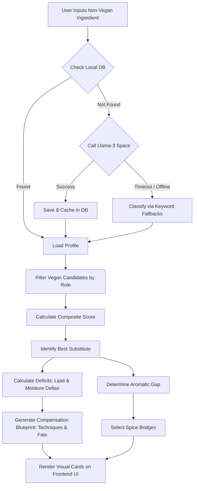

# Chemically-Aware Vegan Substitution Engine: Architecture & Design Decisions

This document outlines the detailed inner workings, mathematical logic, and architectural trade-offs behind the **Chemically-Aware Vegan Substitution Engine** built for the *Ratatouille* platform.

---

## ⚡ Quick-Reference: Single-Line Segment Summaries

*   **Database (`chemical_features.json`):** A physical-chemical ledger mapping food items to their macronutrients, 6D texture profiles, and active flavor compounds.
*   **Aromatic Matcher (Jaccard Similarity):** Computes flavor overlap by taking the intersection of volatile chemical compounds divided by their union.
*   **Texture Matcher (Normalized Euclidean):** Compares physical properties across 6D coordinate vectors (hardness, chewiness, fibrousness, moisture, elasticity, granularity) and bounds the distance to a 0–1 score.
*   **Functional Filter (Culinary Roles):** Ensures a meat is only swapped with a bulk protein, and butter is only swapped with a fat source to maintain structural integrity.
*   **Delta Analyzer ($\vec{\Delta}$ Mathematics):** Subtracts the substitute's macro/texture coordinates from the original's to identify exact fat and moisture deficits.
*   **Correction Generator (Language Guardrails):** Translates calculated deficits into concrete culinary steps like pressing out excess water or pan-searing.
*   **Spice Bridge Optimizer (Volatile Alignment):** Recommends specific common kitchen spices that share volatile molecules with the original ingredient to mask the substitute's plant notes.
*   **Tiered Bootstrap Pipeline (DB ➔ LLM ➔ Fallback):** Reads cached ingredients first, queries a Llama-3 space to generate new JSON profiles on the fly, and uses static keyword templates if offline.

---

## 🛠️ Detailed Architectural Deep Dive

### 1. The Core Matching Algorithm
The engine evaluates candidates using a weighted Composite Score:

$$\text{Composite Score} = \alpha \cdot S_{\text{flavor}} + \beta \cdot S_{\text{texture}} + \gamma \cdot S_{\text{role}}$$

Where:
*   **Flavor Similarity ($S_{\text{flavor}}$):** Calculated using the Jaccard index of discrete volatile aromatic compounds. If paneer contains `["diacetyl", "butanoic_acid", "lactic_acid", "acetoin"]` and extra firm tofu contains `["hexanal", "soy_volatiles", "1-octen-3-ol"]`, the intersection is $\emptyset$, yielding a score of `0.0`.
*   **Texture Similarity ($S_{\text{texture}}$):** Evaluated as the normalized Euclidean distance across six coordinates (Hardness, Chewiness, Fibrousness, Moisture, Elasticity, Granularity), each rated 1 to 5.
    
    $$d(\vec{u}, \vec{v}) = \sqrt{\sum_{i=1}^{6} (u_i - v_i)^2}$$
    
    $$S_{\text{texture}} = 1.0 - \frac{d(\vec{u}, \vec{v})}{\sqrt{6 \times (5-1)^2}} \approx 1.0 - \frac{d(\vec{u}, \vec{v})}{9.798}$$

*   **Functional Fit ($S_{\text{role}}$):** Binary filter ($1.0$ or $0.0$). A bulk protein (chicken) cannot be substituted with a creamy liquid (coconut milk) to prevent ruining the dish structure.

### 2. Culinary Correction & Delta Recommendations
Once the best substitute is selected (e.g., swapping paneer with tofu), the engine calculates the delta vector:

$$\vec{\Delta} = \vec{V}_{\text{original}} - \vec{V}_{\text{substitute}}$$

*   **Lipid Deficit (Fat):** If $\Delta_{\text{fat}} > 0.1$, the engine injects fats matching the recipe archetype (e.g., cold-pressed olive oil for cold salads, neutral/coconut oil for hot curries).
*   **Moisture Excess/Deficit (Water):** If $\Delta_{\text{water}} < -0.1$ (tofu is more watery than paneer), the engine outputs a pressing technique. If $\Delta_{\text{water}} > 0.2$ (soya chunks are dry), it outputs a hot-water rehydration technique.
*   **Textural Deficit:** Hardness, chewiness, or fibrousness gaps trigger structural preparation guidelines (e.g., cross-hatch scoring for mushrooms, freezing/thawing tofu to open porous cells, or shredding jackfruit).

---

## 🧠 Architectural Trade-Offs & Decisions

### 1. Why Jaccard Similarity of Discrete Volatiles instead of Vector Embeddings?
*   **Decision:** We represented flavor as a discrete set of chemical volatile names (e.g., *hexanal*, *diacetyl*) and computed Jaccard overlap, rather than using dense vector representations (like Word2Vec, BERT, or molecular structure embeddings).
*   **Alternative considered:** Running ingredients through dense molecular encoders to compute Cosine Closeness.
*   **Why we rejected the alternative:** 
    1.  **Explainability Gap:** Dense embeddings are black boxes. We cannot extract *which* specific chemical compounds caused a low similarity score, making it impossible to calculate a precise **aromatic gap** to build a **Spice Bridge**.
    2.  **Aromatics vs. Semantics:** Embedding models trained on recipes reflect word co-occurrence rather than chemical overlap. They might decide "garlic" and "onion" are highly similar because they appear in the same sentences, but they cannot tell you that smoked paprika supplies *pyrazines* to mimic chicken’s roasted aroma.
    3.  **Low Resource Overhead:** Jaccard calculations on Python sets are sub-millisecond, avoiding the need to run deep-learning model servers just to suggest a food substitute.

### 2. Why a Tiered Bootstrap Pipeline instead of Real-Time API Calls Only?
*   **Decision:** We designed a three-tiered pipeline: Local JSON Database Cache ➔ Hugging Face Llama-3 API ➔ Static Keyword Classifier Fallbacks.
*   **Alternative considered:** Forcing all unknown inputs to call a remote LLM API, or failing immediately for unmapped ingredients.
*   **Why we rejected the alternative:**
    1.  **Cold Starts and Latency:** Hugging Face Spaces go to sleep after inactivity. A cold start takes 1 to 2 minutes. Forcing a real-time call on every new ingredient results in a terrible, unresponsive user experience.
    2.  **Robustness Guard:** If the Hugging Face server goes down or the API key limit is hit, the application would break. By incorporating static fallbacks (e.g., matching the keyword "mutton" to a predefined "red meat" profile), the engine is guaranteed to return a correct, mathematically sound result instantly.
    3.  **Write-through Cache:** When the LLM successfully returns a profile, we immediately write it back into `chemical_features.json`. This ensures that subsequent searches for the same ingredient are instantaneous, shifting the burden off remote servers over time.

### 3. Why Whitelisted Spice Bridging instead of Generic Raw Volatiles?
*   **Decision:** We map flavor deficits to common culinary spices (e.g., cumin, smoked paprika, nutritional yeast) using a whitelisted vocabulary.
*   **Alternative considered:** Matching the missing flavor volatile to any ingredient in the database that has the highest concentration of it.
*   **Why we rejected the alternative:**
    1.  **Practicality in the Kitchen:** If chicken is replaced by tofu, the chemical gap includes sulfur compounds like *hydrogen sulfide*. The database might show that *durian* or *raw cabbage* has high sulfur concentrations. Suggesting a user add durian to a curry to replace chicken is culinary suicide.
    2.  **Usability:** Users cannot buy raw chemical compounds like "methanethiol" or "2-methyl-3-furanthiol" at a local supermarket. By mapping these gaps to a curated list of spices, we translate complex molecular chemistry into actionable, delicious culinary adjustments.

### 4. Why 6D Textural Coordinate Space instead of Simple Keyword Tags?
*   **Decision:** We rate texture on a 6D scale (Hardness, Chewiness, Fibrousness, Moisture, Elasticity, Granularity) rather than simple descriptors like "chewy" or "firm".
*   **Alternative considered:** Tagging foods with textual labels and doing simple lookup mapping.
*   **Why we rejected the alternative:**
    1.  **Lack of Mathematical Precision:** Descriptors do not allow you to compute the *direction* or *magnitude* of a deficit. With 6D vectors, we calculate exactly whether a substitute is too wet, too soft, or missing fibrous structure.
    2.  **Dynamic Calculations:** The vector math allows the language generator to determine if a technique is necessary. For example, a moisture difference of `0.1` requires no action, but a difference of `0.3` triggers a physical pressing instruction. Textual tags cannot scale to compute these thresholds dynamically.
